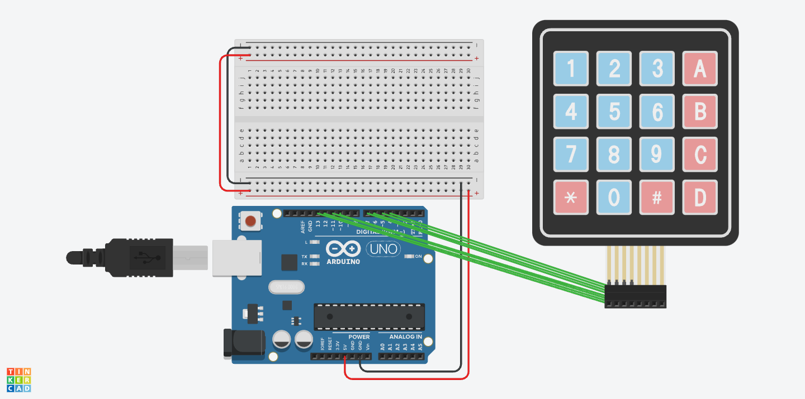
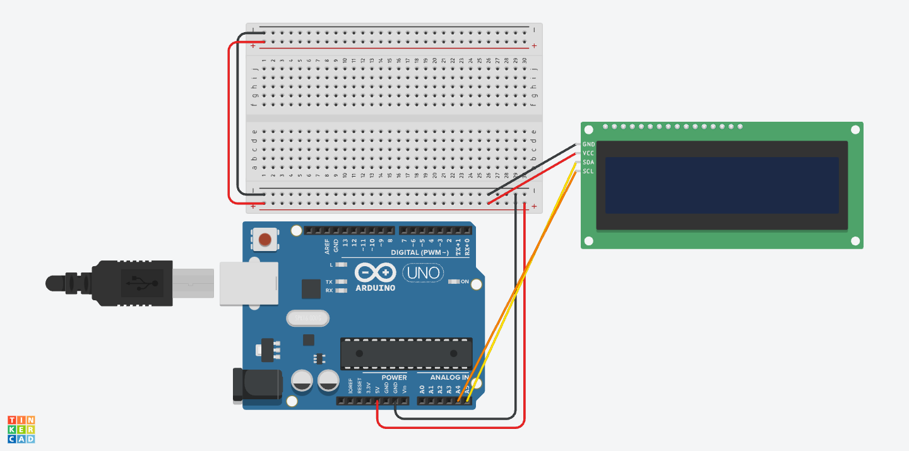

# Fingerprint ID Safe with Keypad
My poject is the Fingerprint ID safe with a keypad. This is a safe box with a keypad sensor and fingerprint sensor to unlock it. After a person puts both the correct password and correct fingerprint in under 5 attempts total, the box will open. 
You should comment out all portions of your portfolio that you have not completed yet, as well as any instructions:
```HTML 

```

| **Engineer** | **School** | **Area of Interest** | **Grade** |
|:--:|:--:|:--:|:--:|
| Anagha V | Leigh High School | Electrical and Computer Engineering | Incoming Senior

**Replace the BlueStamp logo below with an image of yourself and your completed project. Follow the guide [here](https://tomcam.github.io/least-github-pages/adding-images-github-pages-site.html) if you need help.**


  
# Final Milestone

**Don't forget to replace the text below with the embedding for your milestone video. Go to Youtube, click Share -> Embed, and copy and paste the code to replace what's below.**

<iframe width="560" height="315" src="https://www.youtube.com/embed/F7M7imOVGug" title="YouTube video player" frameborder="0" allow="accelerometer; autoplay; clipboard-write; encrypted-media; gyroscope; picture-in-picture; web-share" allowfullscreen></iframe>

For your final milestone, explain the outcome of your project. Key details to include are:
- What you've accomplished since your previous milestone
- What your biggest challenges and triumphs were at BSE
- A summary of key topics you learned about
- What you hope to learn in the future after everything you've learned at BSE


# Second Milestone

**Don't forget to replace the text below with the embedding for your milestone video. Go to Youtube, click Share -> Embed, and copy and paste the code to replace what's below.**

<iframe width="560" height="315" src="https://www.youtube.com/embed/y3VAmNlER5Y" title="YouTube video player" frameborder="0" allow="accelerometer; autoplay; clipboard-write; encrypted-media; gyroscope; picture-in-picture; web-share" allowfullscreen></iframe>

For your second milestone, explain what you've worked on since your previous milestone. You can highlight:
- Technical details of what you've accomplished and how they contribute to the final goal
- What has been surprising about the project so far
- Previous challenges you faced that you overcame
- What needs to be completed before your final milestone
My second milestone was to start putting all my thnigs together in my box. Dimension and cut up my box and get started with one of my modifications. I also started putting together my servo lock mechanism how I would be doing it. So for cutting my box I cut holes for my fingerprint sensor, LCD Scnree, and keypad using a dremmel and drill. Then I screwed these in. For one of my modofications I made a box inside the safe thats closed off but you can open and that is a very small box containing my arduino, my wires, bread board, etc. So I cut up wood for that box and for the side I used a mini metal bracket to connect the sides of the box and my wood. Then for the top piece of wood that can come off and on I used a hinge attached to the side and the top making the top of the mini box to easily come up so I can access the wiring. In the side wall I drilled a small hole so I can fit the wires for my servo through and the servo can be in a seperate box.

# Challenges
I faced a few challenges with building this and putting it together. So first the woodscrews that I was using for hinges and things were so long that they would stick through the outside of the box if I screwed them in fully. To fix this I stuck a 2 washers and one nut in front of the hinge so that when I screwed it, the screw wouldn't poke through the other side of the box. I also had a problem with all my wires still showing with the side wall and if I add a top wall I didn't want to seal it off completly incase I needed to make changes to the wiring. So I added a hinge to the top and side so that it can easily lift up and down when I want. I also had a challenge on what I should do for my servo mechanism because my original plan 


# Wiring Schematics

**Figure #7 - Keypad Wiring (credit: Makerguides)**

<br>

**Figure #7 - Servo Wiring (credit: Makerguides)**

<br>

**Figure #7 - LCD Display Wiring (credit: Makerguides)**

<br>

**Figure #7 - Fingerprint Sensor Wiring Link**
<br>

https://download.mikroe.com/documents/datasheets/R503_datasheet.pdf   


# First Milestone

**Don't forget to replace the text below with the embedding for your milestone video. Go to Youtube, click Share -> Embed, and copy and paste the code to replace what's below.**

<iframe width="560" height="315" src="https://www.youtube.com/embed/CaCazFBhYKs" title="YouTube video player" frameborder="0" allow="accelerometer; autoplay; clipboard-write; encrypted-media; gyroscope; picture-in-picture; web-share" allowfullscreen></iframe>

My first milestone was to wire up all my sensors to my arduino and breadboard. Also to start my coding for the keypad by printing out different things when I input something into the keypad. The sensors I wired to my arduino and breadboard was an on and off switch, fingerprint sensor, 3 by 4 keypad, LCD screen, and servo motor. I first wired up all the black wires to ground and red wires to 5V. Then i wired the other wires to different pins in the arduino. My on and off button takes less voltage so I wired it to the breadboard and used a resister to make sure it was accepting the right amount of power. I finished all of the wiring part so now I just have to focus on a lot of the code to integrate all the sensors together and building the actual box. 

# Challenges
I faced challenges with both the code and wiring for my first milestone. When I first was wiring up all my sensors I tested each of the indivudual sensors to make sure they work before I started on whole code. My servo motor wasn't moving at all but it did vibrate a bit. I tested it through different pins and a new arduino and it still didn't work. After this instead of using my computer as a power source I used a battery pack as well as a 9V pack which both didnt work. My last option that I did was using a 9V adapter and plugging it into the wall which did work. This was because the power from the other sourcfe was only enough to make the servo vibrate a bit not spin, the power from the wall was enough to make it spin though. Another challenge I faced was my keypad code wasn't working even though it theoretically should have. When I went to seriel moniter on arduino I realized that since the code was in void loop it wasn't waiting for me to put an input to start running the code it just kept running the loop evgen without keys pressed which caused the keypad not to work. To fix this I used if(key != NO_KEY); which means and char key = keypad.getKEY();. So this means that if no key is not presssed then it waits to press and adds input += key which means it waits for 5 characters total based on my other code to print something out. 

# Plan
My plan to complete my project is working on all the circuit wiring first and as I wire to test each motor/sensor to make sure everything is working seperately. Then to do all the code so I wrote the code for the keypad with the servo first. After this worked I added LCD displays for each part of the process for unlocking the safe, then I added the addition of needing a fingerprint to open the safe to the code. Then I will work on building the box and putting together everything. So I plan on cutting up the box like the holes for the LCD screen, fingerprint sensor, and keypad, insert those and screw them in. Then I alsoplan to add a modification for my second milestone which is adding like a sectioned off area which is where all my wires, breadboard, and arduino are in. That section is also closed from the top but it has a hinge door so its easy to access change up. 

# Schematics 
Here's where you'll put images of your schematics. [Tinkercad](https://www.tinkercad.com/blog/official-guide-to-tinkercad-circuits) and [Fritzing](https://fritzing.org/learning/) are both great resoruces to create professional schematic diagrams, though BSE recommends Tinkercad becuase it can be done easily and for free in the browser. 

# Code
Here's where you'll put your code. The syntax below places it into a block of code. Follow the guide [here]([url](https://www.markdownguide.org/extended-syntax/)) to learn how to customize it to your project needs. 

```c++
// this sketch will allow you to bypass the Atmega chip
// and connect the fingerprint sensor directly to the USB/Serial
// chip converter.

// Red connects to +5V
// Black connects to Ground
// White goes to Digital 0
// Green goes to Digital 1

#include <Servo.h>
#include <Keypad.h>
#include <Adafruit_Fingerprint.h>
#include <LiquidCrystal_I2C.h>


Servo servo;
String input = "";
String password = "#3575";

const byte ROWS = 4;
const byte COLS = 3;
const int buzzer = 9;


char keys[ROWS][COLS] = 
{
{'1', '2', '3'},
{'4', '5', '6'},
{'7', '8', '9'},
{'*', '0', '#'}
};

byte rowsPins[ROWS] = {9, 8, 10, 11};
byte colsPin[COLS] = {5, 6, 7};
int attempts = 5;
int angle = 0;


Keypad keypad = Keypad(makeKeymap(keys), rowsPins, colsPin, ROWS, COLS);

SoftwareSerial mySerial(2, 3);
Adafruit_Fingerprint finger = Adafruit_Fingerprint(&mySerial);


LiquidCrystal_I2C lcd(0x27,20,4);  // set the LCD address to 0x27 for a 16 chars and 2 line display

bool passwordCleared = false;

int getFingerprintID() {
  uint8_t p = finger.getImage();
  if (p != FINGERPRINT_OK) return -1;

  p = finger.image2Tz();
  if (p != FINGERPRINT_OK) return -1;

  p = finger.fingerSearch();
  if (p != FINGERPRINT_OK) return -1;

  Serial.print("Found ID #"); Serial.println(finger.fingerID);
  return finger.fingerID;
}

void setup() {

Serial.begin(9600);

 mySerial.begin(57600);
  finger.begin(57600);

  servo.attach(4); 
  servo.write(0);

  pinMode(buzzer, OUTPUT)

 

  if (finger.verifyPassword()) {
    Serial.println("Fingerprint sensor found!");
  } else {
    Serial.println("Fingerprint sensor not found :(");
  }

  lcd.init();      
  lcd.backlight();    
  
  lcd.setCursor(0, 0);
  lcd.print("Enter password:");


}
void loop() {


  

  char key = keypad.getKey();


  if (key != NO_KEY)
  {
    Serial.println("key pressed");

  Serial.print(key);

  if (key == '*') // if astericks, clear
  {
    input = "";

    lcd.clear();
    lcd.setCursor(0, 0);
    lcd.print("Cleared, Retry!");

  }
 // else{
  input += key;

   Serial.print("Current input: ");
    Serial.println(input);

   lcd.setCursor(0, 1);
    lcd.print(input);


 // }

  if (input.length() > 1 and key == "#")
  {

    
    Serial.println("Start with '#' before entering passsword");

    lcd.clear();
      lcd.setCursor(0, 0);
      lcd.print("Start with #");
      input = "";
      return;
  }

  if (input.length() == 5){
      Serial.print(input);
      if (input == password){
        Serial.println("Cleared, enter fingerprint now");
          lcd.clear();
          lcd.setCursor(0,0);
          lcd.print("Correct!");
          lcd.setCursor(0,1);
          lcd.print("Scan finger now");

                  int fID = -1;
          unsigned long startTime = millis();
          lcd.clear();
          lcd.setCursor(0, 0);
          lcd.print("Waiting for");
          lcd.setCursor(0, 1);
          lcd.print("finger...");
          Serial.println("Waiting for finger for 10 seconds...");

          while (millis() - startTime < 10000) {  // Wait for 10 seconds
            fID = getFingerprintID();
            if (fID > 0) break;  // Found a fingerprint
          }

          if (fID == 4) {
            Serial.println("Fingerprint ID 4 Identified");
            lcd.clear();
            lcd.setCursor(4, 1);
            lcd.print("Fingerprint");
            lcd.setCursor(4, 2);
            lcd.print("Identified!");
            delay(2000);
            lcd.clear();
            lcd.setCursor(2, 1);
            lcd.print("Will now unlock");
            angle = 180;
            servo.write(angle);
          } else {
            Serial.println("Wrong fingerprint or try again");
            attempts--;
            input = "";
            lcd.clear();
            lcd.setCursor(0, 0);
            lcd.print("Wrong finger!");
            lcd.setCursor(0, 1);
            lcd.print(String(attempts) + " attempts left");
            delay(3000);

            if (attempts <= 0) {
              lcd.clear();
              lcd.setCursor(0, 0);
              lcd.print("Too many fails!");
              servo.write(0);  // Lock (optional)
              while (true);    // Stop everything
            tone(buzzerPin, 1000);
            delay(5000);
            noTone(buzzerPin);

            }
input = "";
            lcd.clear();
            lcd.setCursor(0, 0);
            lcd.print("Enter password:");
            
            return;
          }


          }
          else {
            Serial.print("Password is incorrect");

            Serial.print(attempts);

            Serial.print(" attempts left");

            lcd.clear();
              lcd.setCursor(0,0);
              lcd.print("Password is wrong");
              lcd.setCursor(10, 1);
              lcd.print(attempts);
              lcd.setCursor(2,2);
              lcd.print(" attempts left");
                      delay(3000);

            lcd.clear();
            lcd.setCursor(0, 0);
            lcd.print("Enter password:");


        attempts  = attempts - 1;
        input = "";
        }
      }
    }    
  }

  // buzzer and push button figure out what and messages
  // do cutting it and figuring out how it opens so what to code for that
  // toggle switch button just for on and off set up? or before
  // see if button is even needed cuz its like 9V powered
  // buzzer found

    
  }


```

# Bill of Materials
Here's where you'll list the parts in your project. To add more rows, just copy and paste the example rows below.
Don't forget to place the link of where to buy each component inside the quotation marks in the corresponding row after href =. Follow the guide [here]([url](https://www.markdownguide.org/extended-syntax/)) to learn how to customize this to your project needs. 

| **Part** | **Note** | **Price** | **Link** |
|:--:|:--:|:--:|:--:|
| Servo Motor | Lock Mechanism | $Price | <a href="https://www.amazon.com/Arduino-A000066-ARDUINO-UNO-R3/dp/B008GRTSV6/"> Link </a> |
| Keypad | What the item is used for | $Price | <a href="https://www.amazon.com/Arduino-A000066-ARDUINO-UNO-R3/dp/B008GRTSV6/"> Link </a> |
| LCD Screen | What the item is used for | $Price | <a href="https://www.amazon.com/Arduino-A000066-ARDUINO-UNO-R3/dp/B008GRTSV6/"> Link </a> |
| Wooden Box | Safe | $Price | <a href="https://www.amazon.com/Arduino-A000066-ARDUINO-UNO-R3/dp/B008GRTSV6/"> Link </a> |
| Fingerprint Sensor | Checking Fingerprint | $Price | <a href="https://www.amazon.com/Arduino-A000066-ARDUINO-UNO-R3/dp/B008GRTSV6/"> Link </a> |
| Arduino Uno | Send Code interacts with Sensors | $Price | <a href="https://www.amazon.com/Arduino-A000066-ARDUINO-UNO-R3/dp/B008GRTSV6/"> Link </a> |
| BreadBoard | What the item is used for | $Price | <a href="https://www.amazon.com/Arduino-A000066-ARDUINO-UNO-R3/dp/B008GRTSV6/"> Link </a> |
| Jumper Wires | What the item is used for | $Price | <a href="https://www.amazon.com/Arduino-A000066-ARDUINO-UNO-R3/dp/B008GRTSV6/"> Link </a> |
| Screws |  | $Price | <a href="https://www.amazon.com/Arduino-A000066-ARDUINO-UNO-R3/dp/B008GRTSV6/"> Link </a> |
| Metal Brackets | Lock Mechanism (if needed) | $Price | <a href="https://www.amazon.com/Arduino-A000066-ARDUINO-UNO-R3/dp/B008GRTSV6/"> Link </a> |

# Starter Project: Retro Game Soldering Kit
https://www.youtube.com/embed/Ftf7Nms5TLQ?si=cT8QTLggC5kSKzwF

# Summary:

I chose this retro game soldering kit because I wanted something I could use everyday. The way it works is there is a power on button which when you press it clicks down and completes a circuit which allows the game to power on. This is a precoded game so the main point is to build and use soldering to put the game together. I used a USB socket and connected it to an external power source to power the game, but you can also use a battery pack to power it. 


# Components Used:
- USB Socket (5V)
- Dot Matrix 16*8
- Screws and Nuts
- Digital Tube (Timer)
- Capacitance
- Keys
- Buzzer
- Power Switch
- Battery Box
- Wire
- Hex Copper Pillars
- Key Cap

# Challenges:
Some challenges I faced was soldering without melting the plastic portion of the board off. Also soldering the wires from the battery pack into the designated area because of how thin the wires were. Since I had trouble with the wiring of the batteries, I used the USB Socket to connect it to an external power source like a computer or a plug to power the game. Another challenge I faced was with the USB socket showing through the sides of the glass, I took the game apart soldered the USB Socket to the board and then put the sides together for it to work. 


# Other Resources/Examples
One of the best parts about Github is that you can view how other people set up their own work. Here are some past BSE portfolios that are awesome examples. You can view how they set up their portfolio, and you can view their index.md files to understand how they implemented different portfolio components.
- [Example 1](https://trashytuber.github.io/YimingJiaBlueStamp/)
- [Example 2](https://sviatil0.github.io/Sviatoslav_BSE/)
- [Example 3](https://arneshkumar.github.io/arneshbluestamp/)

To watch the BSE tutorial on how to create a portfolio, click here.
