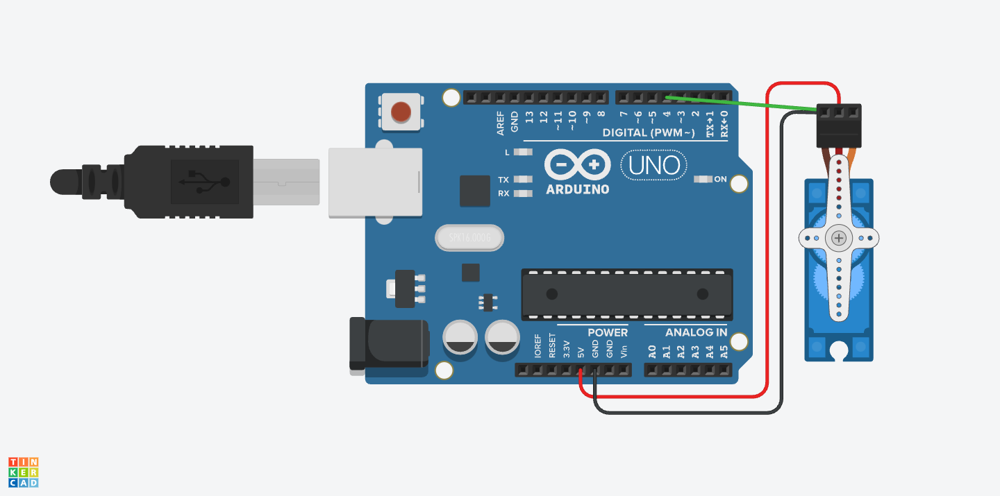

# Fingerprint ID Safe with Keypad
My poject is the Fingerprint ID safe with a keypad. This is a safe box with a keypad sensor and fingerprint sensor to unlock it. After a person puts both the correct password and correct fingerprint in under 5 attempts total, the box will open. 


| **Engineer** | **School** | **Area of Interest** | **Grade** |
|:--:|:--:|:--:|:--:|
| Anagha V | Leigh High School | Electrical and Computer Engineering | Incoming Senior


# Third Milestone

<iframe width="560" height="315" src="https://www.youtube.com/embed/8u7v6ouedhc?start=1&controls=0" title="YouTube video player" frameborder="0" allow="accelerometer; autoplay; clipboard-write; encrypted-media; gyroscope; picture-in-picture; web-share" allowfullscreen></iframe>

For my third milestone, my main goal was to complete the full integration of all my planned software modification into the ESP32 system as well as succesfully make an OTP code that would override the normal input incase someone forgets the password. 
To begin with I made a menu screen that apperas on the LCD screen. This menu allows users to navigate through various feautres using the keypad. This is organized into two screens of options to keep the display clear and easy to use, users can switch between them by pressing the '0' key. This ensures that with many available options, its easy to use. 
The options I added in my menu are:

Add a new password: they can create and store a new password then click on that if they want it

Change password: allows users to modify a previously stored password.
Add a fingerprint: they can add a fingerprint to an ID and there are 127 IDs that are available

Delete a fingerprint: fingerprint deletion feature so allows users to delete fingerprints that are no longer needed

Forgot password: this is a more advanced feauture and if the user forgots the password they can send an OTP to an email or something. 

Throughout the process of developing this I focused on like one goal at a time to make it clean and not complicated and hard to code. Doing this made the process way faster and easier. 

# Challenges
Some challenges I had with this was one when I first coded my adding a fingerprint it always overrid my ID one instead of making a new ID. I used a for loop for the 127 different empty slots for the fingerprints to be able to change to the next ID each time we do it. Also I had challenges with my code because the libraries I previously used for my arduino weren't all compatible with an esp32 ao I had to switch out the libraries and some of my code. 

# Second Milestone

<iframe width="560" height="315" src="https://www.youtube.com/embed/AEdhSK_Sfzw" title="YouTube video player" frameborder="0" allow="accelerometer; autoplay; clipboard-write; encrypted-media; gyroscope; picture-in-picture; web-share" allowfullscreen></iframe>

My second milestone was to start putting all my thnigs together in my box. Dimension and cut up my box and get started with one of my modifications. I also started putting together my servo lock mechanism how I would be doing it. So for cutting my box I cut holes for my fingerprint sensor, LCD Scnree, and keypad using a dremmel and drill. Then I screwed these in. For one of my modofications I made a box inside the safe thats closed off but you can open and that is a very small box containing my arduino, my wires, bread board, etc. So I cut up wood for that box and for the side I used a mini metal bracket to connect the sides of the box and my wood. Then for the top piece of wood that can come off and on I used a hinge attached to the side and the top making the top of the mini box to easily come up so I can access the wiring. In the side wall I drilled a small hole so I can fit the wires for my servo through and the servo can be in a seperate box. I also changed the way my servo mechanism worked. I am using a wooden dowel attached to the servo arm. The servo arm I cut in half so it can be attached to the wall. I have screw eye rings which are attached to the top of the box and the side of the box and the wooden dowel goes through them when the servo movies. This would lock it in place. I also started with changing my project from an arduino uno to an esp32, so I can have a wifi connected microcontroller. I had to rewire all of my circuits, restest, and adjust my code a lot for it to be compatible with an esp32. 

# Challenges 
I faced a few challenges with building this and putting it together. So first the woodscrews that I was using for hinges and things were so long that they would stick through the outside of the box if I screwed them in fully. To fix this I stuck a 2 washers and one nut in front of the hinge so that when I screwed it, the screw wouldn't poke through the other side of the box. I also had a problem with all my wires still showing with the side wall and if I add a top wall I didn't want to seal it off completly incase I needed to make changes to the wiring. So I added a hinge to the top and side so that it can easily lift up and down when I want. I also had a challenge on what I should do for my servo mechanism because my original plan. I had a lot of challenges with rewriring my esp32 because the formatting is kind of different from a arduino and it was confusing to see the different pins that work with the different motors and align it properly. Also since the esp32 was attached to a breadboard I had to rewire a few of the pins outside so I can plug a jumper wire to that horizontally and make it work. I also had some trouble with my actual code that I finished for the base project with extra modifications to work with the esp32 because some libraries that were compatible with arduino weren't compatible with esp32 so I had to download different libraries and also change code. Like I had to change code from softWareSerial to hardware Serial. 

# Plan
So my plan for my next steps is to think of more modifications I want to do. Also maybe spray paint my box black to give it a clean polished look. I also want to add black electrical tape around the edges of the LCD so it appears smoother because the dremmel cut wasn't that smooth on the box. Sanding it more will make it to big so I want to add electrical tape. I also plan to adjust my code a lot because on the menu I want to implement a feature that allows me to go between two pages so on one page: add fingerprint, change password, forgot password for otp, change menu, go back to menu, add password, etc. For my main menu I am having an issue with the main menu, first when I am trying to add a fingerprint its not like detecting that so its just skipping past that. Also when I try to switch between pages it allows me too but first makes me reenter the password and fingerprint which if possible I want to find a way to fix so its easier access between those two. 


# First Milestone

<iframe width="560" height="315" src="https://www.youtube.com/embed/iwInNOWHW_U" title="YouTube video player" frameborder="0" allow="accelerometer; autoplay; clipboard-write; encrypted-media; gyroscope; picture-in-picture; web-share" allowfullscreen></iframe>


My first milestone was to wire up all my sensors to my arduino and breadboard. Also to start my coding for the keypad by printing out different things when I input something into the keypad. The sensors I wired to my arduino and breadboard was an on and off switch, fingerprint sensor, 3 by 4 keypad, LCD screen, and servo motor. I first wired up all the black wires to ground and red wires to 5V. Then i wired the other wires to different pins in the arduino. My on and off button takes less voltage so I wired it to the breadboard and used a resister to make sure it was accepting the right amount of power. I finished all of the wiring part so now I just have to focus on a lot of the code to integrate all the sensors together and building the actual box. 

# Challenges
I faced challenges with both the code and wiring for my first milestone. When I first was wiring up all my sensors I tested each of the indivudual sensors to make sure they work before I started on whole code. My servo motor wasn't moving at all but it did vibrate a bit. I tested it through different pins and a new arduino and it still didn't work. After this instead of using my computer as a power source I used a battery pack as well as a 9V pack which both didnt work. My last option that I did was using a 9V adapter and plugging it into the wall which did work. This was because the power from the other sourcfe was only enough to make the servo vibrate a bit not spin, the power from the wall was enough to make it spin though. Another challenge I faced was my keypad code wasn't working even though it theoretically should have. When I went to seriel moniter on arduino I realized that since the code was in void loop it wasn't waiting for me to put an input to start running the code it just kept running the loop evgen without keys pressed which caused the keypad not to work. To fix this I used if(key != NO_KEY); which means and char key = keypad.getKEY();. So this means that if no key is not presssed then it waits to press and adds input += key which means it waits for 5 characters total based on my other code to print something out. 

# Plan
My plan to complete my project is working on all the circuit wiring first and as I wire to test each motor/sensor to make sure everything is working seperately. Then to do all the code so I wrote the code for the keypad with the servo first. After this worked I added LCD displays for each part of the process for unlocking the safe, then I added the addition of needing a fingerprint to open the safe to the code. Then I will work on building the box and putting together everything. So I plan on cutting up the box like the holes for the LCD screen, fingerprint sensor, and keypad, insert those and screw them in. Then I alsoplan to add a modification for my second milestone which is adding like a sectioned off area which is where all my wires, breadboard, and arduino are in. That section is also closed from the top but it has a hinge door so its easy to access change up. 

# Code First Milestone 

``` c++
// this sketch will allow you to bypass the Atmega chip
// and connect the fingerprint sensor directly to the USB/Serial
// chip converter.

// Red connects to +5V
// Black connects to Ground
// White goes to Digital 0
// Green goes to Digital 1

#include <Servo.h>
#include <Keypad.h>
#include <Adafruit_Fingerprint.h>


Servo servo;
String input = "";
String password = "#3575";

const byte ROWS = 4;
const byte COLS = 3;

char keys[ROWS][COLS] = 
{
{'1', '2', '3'},
{'4', '5', '6'},
{'7', '8', '9'},
{'*', '0', '#'}
};

byte rowsPins[ROWS] = {9, 8, 10, 11};
byte colsPin[COLS] = {5, 6, 7};
int attempts = 5;
int angle = 0;


Keypad keypad = Keypad(makeKeymap(keys), rowsPins, colsPin, ROWS, COLS);


void setup() {

Serial.begin(9600);
  servo.attach(12); 
  servo.write(0);


}
void loop() {


  

  char key = keypad.getKey();


  if (key != NO_KEY)
  {
    Serial.println("key pressed");

  Serial.print(key);

  if (key == '*') // if astericks, clear
  {
    input = "";

  }
  else{
  input += key;
  }
    Serial.print("Current input: ");
    Serial.println(input);


  if (input.length() > 1 and key == "#")
  {
    Serial.println("Start with '#' before entering passsword");
    input = "";
  }

  if (input.length() == 5){
      Serial.print(input);
      if (input == password){
        // TODO : allow servo to move accordingly
        Serial.println("Cleared, enter fingerprint now");
        angle = 180;
        servo.write(angle);

      }
      else {
        Serial.print("Password is incorrect ");

        Serial.print(attempts);

        Serial.print(" attempts left");

        attempts  = attempts - 1;
        input = "";
    }
    }
    }


   // add code for fingerprint too
    
  }

```
# Schematics 

**Figure #7 - Keypad Wiring (credit: Makerguides)**

<br>

**Figure #7 - Servo Wiring (credit: Makerguides)**

<br>

**Figure #7 - LCD Display Wiring (credit: Makerguides)**

<br>

**Figure #7 - Fingerprint Sensor Wiring Link**
<br>

https://download.mikroe.com/documents/datasheets/R503_datasheet.pdf   

# ESP32 SCHEMATICS
**Figure #1 - LCD Display Wiring**

<br>

**Figure #2 - Servo Layout**  

<br>

**Figure #3 - Keypad Wiring**

<br>


# Code


```c++
//libraries
#include <Keypad.h>
#include <Adafruit_Fingerprint.h>
#include <LiquidCrystal_I2C.h>
#include <Wire.h>
#include <HardwareSerial.h>
#include <WiFi.h>
#include <ESP32Servo.h>
#include <ESP_Mail_Client.h>

// WiFi defineing
const char* ssid = "Stratford Guest";
const char* wifiPassword = "SPBSchool@3800";

// Email credentials using the simple mail transfer protocol to define
#define SMTP_HOST "smtp.gmail.com"
#define SMTP_PORT 465
#define AUTHOR_EMAIL "esp32codesend@gmail.com"
#define AUTHOR_PASSWORD "twuvslmhxjlvaxhh"
#define RECIPIENT_EMAIL "vasudevan.anagha@gmail.com"

// Servo + everythnig else  variables defining
Servo servo;
String input = "";
String password1 = "#3575";
String password2 = "#1234";
String password3 = "#0000";
String* currentPassword = &password1; //using poiknter to store the password1 value into currentpassword
int selectedPassword = 0;

bool changeMode = false; //changinas password yes or no
bool addMode = false; //adding new passsword yes or no
int passwordToChange = 0; //password slot to change
int attempts = 4; //num of attempts for like diong it
bool unlocked = false;  //whether itsubnloced or locked determines also the screen its on
int menuPage = 0;

const byte ROWS = 4;
const byte COLS = 3;
const int buzzerPin = 9;

char keys[ROWS][COLS] = {
  {'1', '2', '3'},
  {'4', '5', '6'},
  {'7', '8', '9'},
  {'*', '0', '#'}
};

byte rowsPins[ROWS] = {27, 26, 33, 32};
byte colsPins[COLS] = {13, 12, 14};

Keypad keypad = Keypad(makeKeymap(keys), rowsPins, colsPins, ROWS, COLS);
HardwareSerial mySerial(2);
Adafruit_Fingerprint finger(&mySerial);
LiquidCrystal_I2C lcd(0x27, 20, 4);

// Generate a 4-digit OTP
String generateOTP() {
  String otp = "#";
  for (int i = 0; i < 4; i++) {
    otp += String(random(0, 10));
  }
  return otp;
}

// Send OTP via Email
void sendEmailOTP(String otp) {
  SMTPSession smtp; //smtp session instance
  SMTP_Message message; //smtp email instance 

  smtp.debug(1); //debugging output
  smtp.callback([](SMTP_Status status) {
    Serial.println(status.info());
    if (status.success()) {
      Serial.println("Email sent successfully");
    }
  });
//setup email server session
  ESP_Mail_Session session;
  session.server.host_name = SMTP_HOST;
  session.server.port = SMTP_PORT;
  session.login.email = AUTHOR_EMAIL;
  session.login.password = AUTHOR_PASSWORD;
  session.login.user_domain = "";

//compose email like how it is
  message.sender.name = "ESP32 Lock";
  message.sender.email = AUTHOR_EMAIL;
  message.subject = "Your OTP for Access";
  message.addRecipient("User", RECIPIENT_EMAIL);

  String body = "Your OTP is: " + otp;
  message.text.content = body.c_str();

//connecting to mail server
  if (!smtp.connect(&session)) {
    Serial.println("Failed to connect to mail server");
    return;
  }

//checking for email sending errors
  if (!MailClient.sendMail(&smtp, &message)) {
    Serial.print("Error sending Email, reason: ");
    Serial.println(smtp.errorReason());
  }

  smtp.closeSession(); //close that connection smtp session
}

// Find the next free fingerprint ID
int getNextFreeID() {
  for (int id = 1; id < 127; id++) {
    if (finger.loadModel(id) != FINGERPRINT_OK) {
      return id;
    }
  }
  return -1;
}

// Identify fingerprint
int getFingerprintID() {
  uint8_t p = finger.getImage();
  if (p != FINGERPRINT_OK) return -1;
  p = finger.image2Tz();
  if (p != FINGERPRINT_OK) return -1;
  p = finger.fingerSearch();
  if (p != FINGERPRINT_OK) return -1;

  Serial.print("Found ID #");
  Serial.println(finger.fingerID);
  return finger.fingerID;
}

// Fingerprint enrollment process
void enrollFingerprint() {
  lcd.clear();
  lcd.print("Place finger...");
  unsigned long enrollStart = millis();
  while (finger.getImage() != FINGERPRINT_OK) {
    if (keypad.getKey()) {
      lcd.clear();
      lcd.print("Cancelled");
      delay(2000);
      return;
    }
    if (millis() - enrollStart > 15000) {
      lcd.clear();
      lcd.print("Timeout");
      delay(2000);
      return;
    }
  }

  if (finger.image2Tz(1) != FINGERPRINT_OK) {
    lcd.clear();
    lcd.print("Failed step 1");
    delay(2000);
    return;
  }

  lcd.clear();
  lcd.print("Remove finger");
  delay(2000);
  lcd.clear();
  lcd.print("Place again...");
  enrollStart = millis();

  while (finger.getImage() != FINGERPRINT_OK) {
    if (keypad.getKey()) {
      lcd.clear();
      lcd.print("Cancelled");
      delay(2000);
      return;
    }
    if (millis() - enrollStart > 15000) {
      lcd.clear();
      lcd.print("Timeout");
      delay(2000);
      return;
    }
  }

  if (finger.image2Tz(2) != FINGERPRINT_OK || finger.createModel() != FINGERPRINT_OK) {
    lcd.clear();
    lcd.print("Failed to save");
    delay(2000);
    return;
  }

  int newID = getNextFreeID();
  if (newID == -1) {
    lcd.clear();
    lcd.print("No space left");
    delay(2000);
    return;
  }

  if (finger.storeModel(newID) != FINGERPRINT_OK) {
    lcd.clear();
    lcd.print("Save failed");
    delay(2000);
    return;
  }

  lcd.clear();
  lcd.print("Stored as ID:");
  lcd.setCursor(0, 1);
  lcd.print(newID);
  delay(2000);

  unlocked = true;
  input = "";
}

// Show masked passwords on LCD (last 2 digits only)
void showPasswords() {
  lcd.clear();
  lcd.print("Pass 1: ****" + password1.substring(password1.length() - 2));
  lcd.setCursor(0, 1);
  lcd.print("Pass 2: ****" + password2.substring(password2.length() - 2));
  lcd.setCursor(0, 2);
  lcd.print("Pass 3: ****" + password3.substring(password3.length() - 2));
  lcd.setCursor(0, 3);
  lcd.print("Press any key");

  while (!keypad.getKey()) {
    delay(100);
  }
}

// Delete fingerprint by ID (1-126)
void deleteFingerprint() {
  lcd.clear();
  lcd.print("Del FP ID 1-126:");
  String fpIDStr = "";
  while (true) {
    char key = keypad.getKey();
    if (!key) continue;
    if (key >= '0' && key <= '9') {
      if (fpIDStr.length() < 3) { // max 3 digits
        fpIDStr += key;
        lcd.setCursor(fpIDStr.length() - 1, 1);
        lcd.print(key);
      }
    } else if (key == '*') {
      // Cancel deletion
      lcd.clear();
      lcd.print("Cancelled");
      delay(2000);
      return;
    } else if (key == '#') {
      // Confirm deletion
      int id = fpIDStr.toInt();
      if (id < 1 || id > 126) {
        lcd.clear();
        lcd.print("Invalid ID");
        delay(2000);
        return;
      }
      if (finger.deleteModel(id) == FINGERPRINT_OK) {
        lcd.clear();
        lcd.print("Deleted ID: ");
        lcd.print(id);
      } else {
        lcd.clear();
        lcd.print("Delete failed");
      }
      delay(2000);
      return;
    }
  }
}

void setup() {
  Serial.begin(115200);
  mySerial.begin(57600, SERIAL_8N1, 16, 17);

  servo.attach(23);
  servo.write(0);

  Wire.begin(21, 22);
  lcd.init();
  lcd.backlight();

  WiFi.begin(ssid, wifiPassword);
  lcd.print("Connecting WiFi...");
  while (WiFi.status() != WL_CONNECTED) {
    delay(500);
    Serial.print(".");
  }
  lcd.clear();
  lcd.print("WiFi Connected!");
  delay(1000);

  if (finger.verifyPassword()) {
    Serial.println("Fingerprint sensor found!");
  } else {
    Serial.println("Fingerprint sensor not found :(");
  }

  lcd.clear();
  lcd.setCursor(0, 0);
  lcd.print("Select Password:");
  lcd.setCursor(0, 1);
  lcd.print("Enter 1 or 2 or 3");
  lcd.setCursor(0, 2);
  lcd.print("# = Forgot Pass");
}

void loop() {
  if (unlocked) {
    while (true) {
      lcd.clear();
      if (menuPage == 0) {
        lcd.setCursor(0, 0);
        lcd.print("* = Change Pass");
        lcd.setCursor(0, 1);
        lcd.print("# = Add Pass");
        lcd.setCursor(0, 2);
        lcd.print("1 = Enroll FP");
        lcd.setCursor(0, 3);
        lcd.print("0 = More...");
      } else {
        lcd.setCursor(0, 0);
        lcd.print("2 = Relock");
        lcd.setCursor(0, 1);
        lcd.print("3 = Forgot Pass");
        lcd.setCursor(0, 2);
        lcd.print("4 = View Pass");
        lcd.setCursor(0, 3);
        lcd.print("5 = Delete FP");
      }

      unsigned long menuStart = millis();
      while (millis() - menuStart < 10000) {
        char optKey = keypad.getKey();
        if (!optKey) continue;
        if (optKey == '0') {
          menuPage = (menuPage + 1) % 2;
          break;
        }

        if (menuPage == 0) {
          if (optKey == '*') {
            lcd.clear();
            lcd.print("Change pass:");
            lcd.setCursor(0, 1);
            lcd.print("Press 1 or 2 or 3");
            while (true) {
              char changeKey = keypad.getKey();
              if (changeKey == '1' || changeKey == '2' || changeKey == '3') {
                passwordToChange = changeKey - '0';
                changeMode = true;
                input = "";
                lcd.clear();
                lcd.print("New password:");
                lcd.setCursor(0, 1);
                lcd.print("#xxxx format");
                return;
              }
            }
          } else if (optKey == '#') {
            addMode = true;
            input = "";
            lcd.clear();
            lcd.print("Add new pass:");
            lcd.setCursor(0, 1);
            lcd.print("#xxxx format");
            return;
          } else if (optKey == '1') {
            enrollFingerprint();
            return;
          }
        } else {
          if (optKey == '2') {
            servo.write(0);
            unlocked = false;
            selectedPassword = 0;
            input = "";
            lcd.clear();
            lcd.print("Relocked!");
            delay(2000);
            lcd.clear();
            lcd.setCursor(0, 0);
            lcd.print("Select Password:");
            lcd.setCursor(0, 1);
            lcd.print("1-2-3 = Choose");
            lcd.setCursor(0, 2);
            lcd.print("# = Forgot Pass");
            return;
          } else if (optKey == '3') {
            String otp = generateOTP();
            password3 = otp;
            lcd.clear();
            lcd.print("Sending OTP...");
            sendEmailOTP(otp);
            delay(2000);
            lcd.clear();
            lcd.print("OTP sent!");
            delay(2000);
          } else if (optKey == '4') {
            showPasswords();
          } else if (optKey == '5') {
            deleteFingerprint();
          }
        }
      }
      lcd.clear();
      lcd.print("Timeout");
      delay(2000);
    }
  }

  char key = keypad.getKey();
  if (!key) return;

  // At password select stage
  if (selectedPassword != 1 && selectedPassword != 2 && selectedPassword != 3) {
    if (key == '1') {
      currentPassword = &password1;
      selectedPassword = 1;
    } else if (key == '2') {
      currentPassword = &password2;
      selectedPassword = 2;
    } else if (key == '3') {
      currentPassword = &password3;
      selectedPassword = 3;
    } else if (key == '#') { // Forgot Password - send OTP by email only
      String otp = generateOTP();
      password3 = otp;
      currentPassword = &password3;
      selectedPassword = 3;
      lcd.clear();
      lcd.print("Sending OTP...");
      sendEmailOTP(otp);
      delay(2000);
      lcd.clear();
      lcd.print("OTP sent!");
      lcd.setCursor(0, 1);
      lcd.print("Enter password:");
      input = "";
      return;
    } else {
      lcd.clear();
      lcd.print("Invalid input");
      delay(2000);
      return;
    }
    lcd.clear();
    lcd.print("Enter password:");
    input = "";
    return;
  }

  if (key == '*') {
    input = "";
    lcd.clear();
    lcd.setCursor(0, 0);
    lcd.print("Cleared. Retry:");
    return;
  }

  input += key;
  lcd.setCursor(0, 1);
  lcd.print(input);

  if (input.length() > 1 && input[0] != '#') {
    lcd.clear();
    lcd.print("Start with #");
    input = "";
    return;
  }

  if ((changeMode || addMode) && input.length() == 5) {
    if (changeMode) {
      if (passwordToChange == 1) {
        password1 = input;
      } else if (passwordToChange == 2) {
        password2 = input;
      } else if (passwordToChange == 3) {
        password3 = input;
      }
      lcd.clear();
      lcd.print("Password changed");
    } else if (addMode) {
      password3 = input;
      lcd.clear();
      lcd.print("Pass 3 added");
    }
    delay(2000);
    lcd.clear();
    lcd.print("Enter password:");
    input = "";
    changeMode = false;
    addMode = false;
    passwordToChange = 0;
    return;
  }

  if (input.length() == 5) {
    if (input == password1 || input == password2 || input == password3) {
      lcd.clear();
      lcd.print("Correct!");
      lcd.setCursor(0, 1);
      lcd.print("Scan fingerprint");

      int fID = -1;
      unsigned long startTime = millis();
      while (millis() - startTime < 10000) {
        fID = getFingerprintID();
        if (fID > 0)
          break;
      }

      if (fID != -1) {
        lcd.clear();
        lcd.print("FP OK, ID: ");
        lcd.setCursor(0, 1);
        lcd.print(fID);
        delay(1000);
        lcd.clear();
        lcd.print("Unlocking...");
        servo.write(60);
        unlocked = true;
        delay(2000);
        if (input == password3) {
          password3 = "#0000"; // reset OTP password after use
        }
      } else {
        lcd.clear();
        lcd.print("Wrong fingerprint");
        attempts--;
        delay(2000);
        if (attempts <= 0) {
          lcd.clear();
          lcd.print("Too many fails");
          tone(buzzerPin, 1000);
          delay(5000);
          noTone(buzzerPin);
          while (true) {
            lcd.setCursor(0, 0);
            lcd.print("System Locked!");
            delay(1000);
            yield();
          }
        }
        lcd.clear();
        lcd.print(String(attempts) + " attempts left");
        delay(2000);
        lcd.clear();
        lcd.print("Enter password:");
      }
      input = "";
    } else {
      attempts--;
      lcd.clear();
      lcd.print("Wrong password");
      lcd.setCursor(0, 1);
      lcd.print(String(attempts) + " left");
      delay(2000);
      if (attempts <= 0) {
        lcd.clear();
        lcd.print("Too many fails");
        tone(buzzerPin, 1000);
        delay(5000);
        noTone(buzzerPin);
        while (true) {}
      }
      lcd.clear();
      lcd.print("Enter password:");
      input = "";
    }
  }
}

```

# Bill of Materials

| **Part** | **Note** | **Price** | **Link** |
|:--:|:--:|:--:|:--:|
| Servo Motor | Lock Mechanism | $Price | <a href="https://www.amazon.com/Arduino-A000066-ARDUINO-UNO-R3/dp/B008GRTSV6/"> Link </a> |
| Keypad | What the item is used for | $Price | <a href="https://www.amazon.com/Arduino-A000066-ARDUINO-UNO-R3/dp/B008GRTSV6/"> Link </a> |
| LCD Screen | What the item is used for | $Price | <a href="https://www.amazon.com/Arduino-A000066-ARDUINO-UNO-R3/dp/B008GRTSV6/"> Link </a> |
| Wooden Box | Safe | $Price | <a href="https://www.amazon.com/Arduino-A000066-ARDUINO-UNO-R3/dp/B008GRTSV6/"> Link </a> |
| Fingerprint Sensor | Checking Fingerprint | $Price | <a href="https://www.amazon.com/Arduino-A000066-ARDUINO-UNO-R3/dp/B008GRTSV6/"> Link </a> |
| Arduino Uno | Send Code interacts with Sensors | $Price | <a href="https://www.amazon.com/Arduino-A000066-ARDUINO-UNO-R3/dp/B008GRTSV6/"> Link </a> |
| BreadBoard | What the item is used for | $Price | <a href="https://www.amazon.com/Arduino-A000066-ARDUINO-UNO-R3/dp/B008GRTSV6/"> Link </a> |
| Jumper Wires | What the item is used for | $Price | <a href="https://www.amazon.com/Arduino-A000066-ARDUINO-UNO-R3/dp/B008GRTSV6/"> Link </a> |
| Screws |  | $Price | <a href="https://www.amazon.com/Arduino-A000066-ARDUINO-UNO-R3/dp/B008GRTSV6/"> Link </a> |
| Metal Brackets | Lock Mechanism (if needed) | $Price | <a href="https://www.amazon.com/Arduino-A000066-ARDUINO-UNO-R3/dp/B008GRTSV6/"> Link </a> |
https://www.amazon.com/Arduino-A000066-ARDUINO-UNO-R3/dp/B008GRTSV6/?th=1
| ESP32 | Wifi connected microcontroller | $Price | <a href="https://www.amazon.com/Arduino-A000066-ARDUINO-UNO-R3/dp/B008GRTSV6/"> Link </a> |
| 9V Adapter| Lock Mechanism (if needed) | $Price | <a href="https://www.amazon.com/Arduino-A000066-ARDUINO-UNO-R3/dp/B008GRTSV6/"> Link </a> |
| Servo Half Arms | Lock Mechanism (if needed) | $Price | <a href="https://www.amazon.com/Arduino-A000066-ARDUINO-UNO-R3/dp/B008GRTSV6/"> Link </a> |
| Wooden Dowel | Lock Mechanism (if needed) | $Price | <a href="https://www.amazon.com/Arduino-A000066-ARDUINO-UNO-R3/dp/B008GRTSV6/"> Link </a> |
| Jumper Wires | Lock Mechanism (if needed) | $Price | <a href="https://www.amazon.com/Arduino-A000066-ARDUINO-UNO-R3/dp/B008GRTSV6/"> Link </a> |
| Screws | Lock Mechanism (if needed) | $Price | <a href="https://www.amazon.com/Arduino-A000066-ARDUINO-UNO-R3/dp/B008GRTSV6/"> Link </a> |


# Starter Project: Retro Game Soldering Kit
https://www.youtube.com/embed/Ftf7Nms5TLQ?si=cT8QTLggC5kSKzwF

# Summary:

I chose this retro game soldering kit because I wanted something I could use everyday. The way it works is there is a power on button which when you press it clicks down and completes a circuit which allows the game to power on. This is a precoded game so the main point is to build and use soldering to put the game together. I used a USB socket and connected it to an external power source to power the game, but you can also use a battery pack to power it. 


# Components Used:
- USB Socket (5V)
- Dot Matrix 16*8
- Screws and Nuts
- Digital Tube (Timer)
- Capacitance
- Keys
- Buzzer
- Power Switch
- Battery Box
- Wire
- Hex Copper Pillars
- Key Cap

# Challenges:
Some challenges I faced was soldering without melting the plastic portion of the board off. Also soldering the wires from the battery pack into the designated area because of how thin the wires were. Since I had trouble with the wiring of the batteries, I used the USB Socket to connect it to an external power source like a computer or a plug to power the game. Another challenge I faced was with the USB socket showing through the sides of the glass, I took the game apart soldered the USB Socket to the board and then put the sides together for it to work. 


# Resources
- Example 1: https://github.com/Gracewanggg/Grace_BSE_Portfolio
- Example 2: https://learn.adafruit.com/biometric-security-box/program-and-test
  

